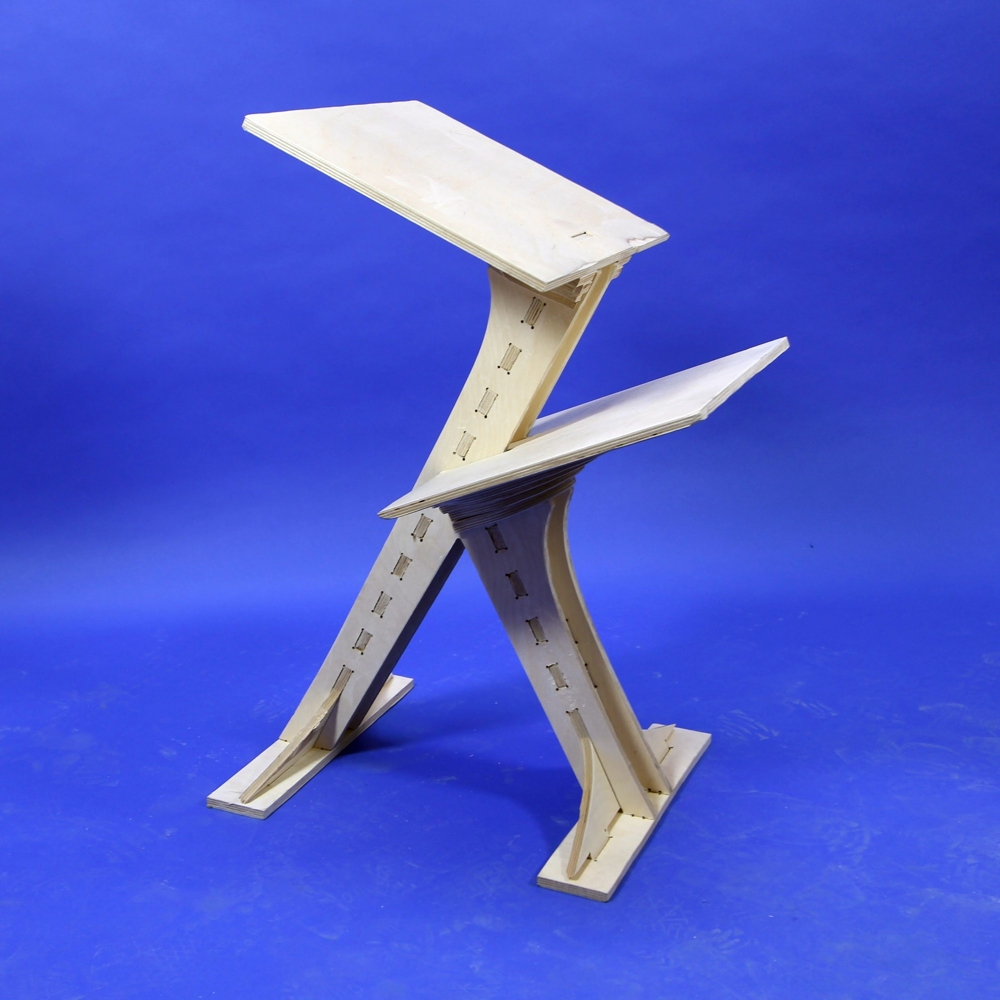
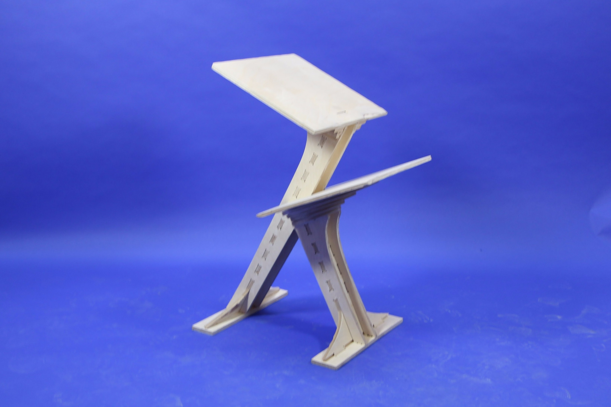
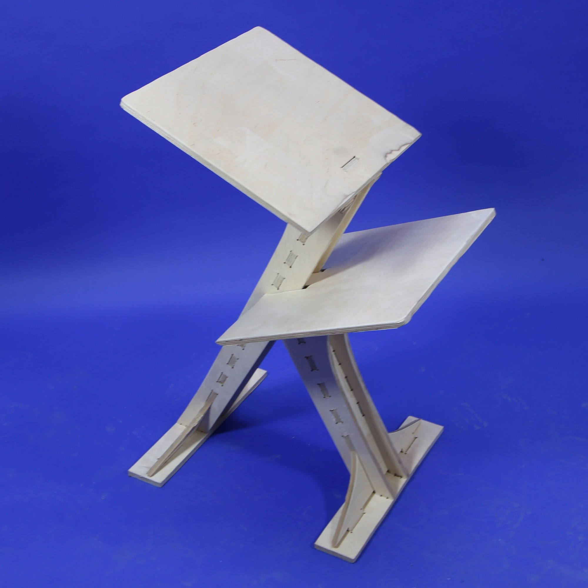
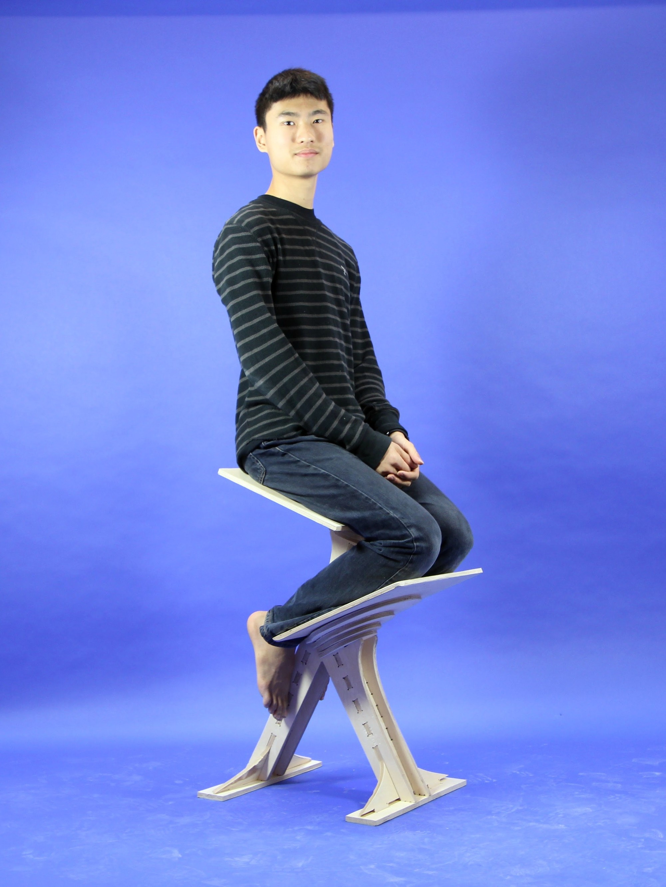
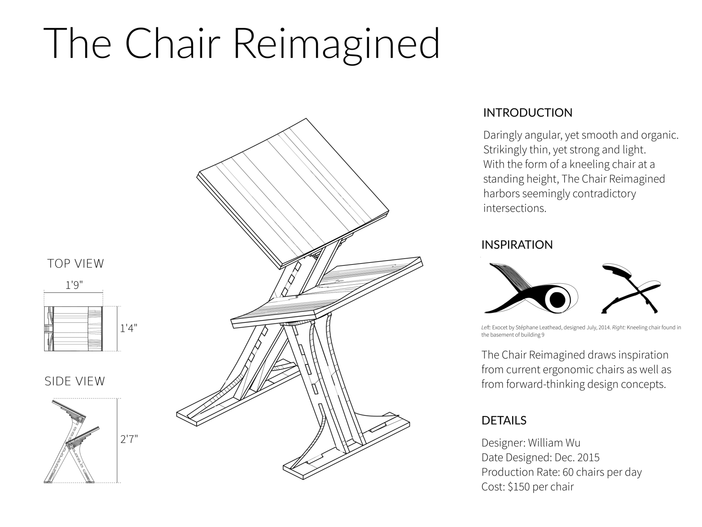
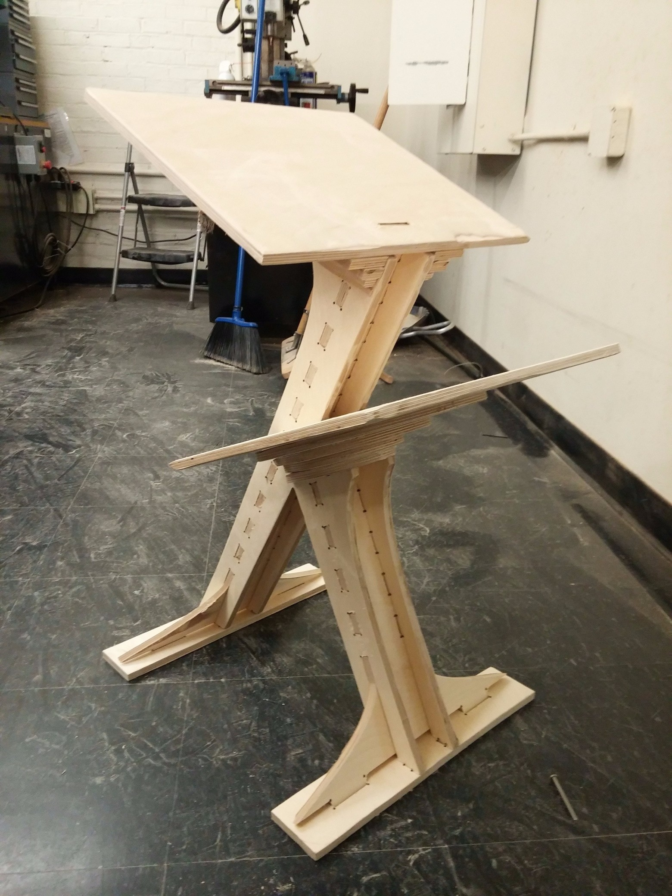
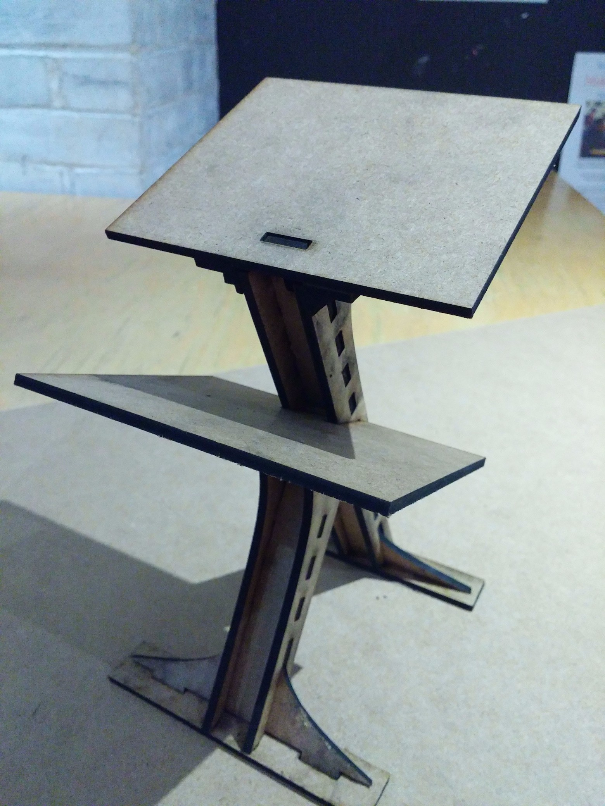
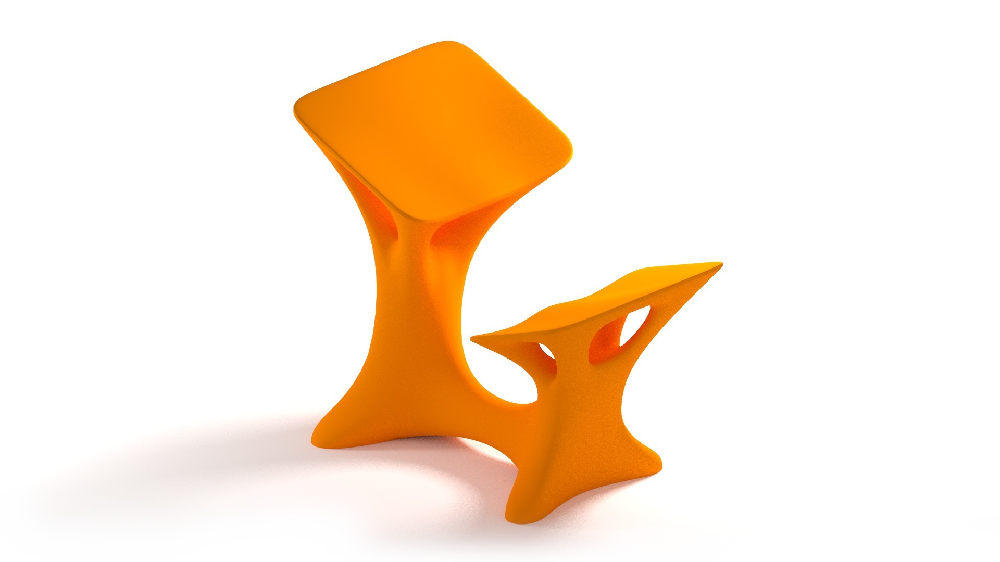
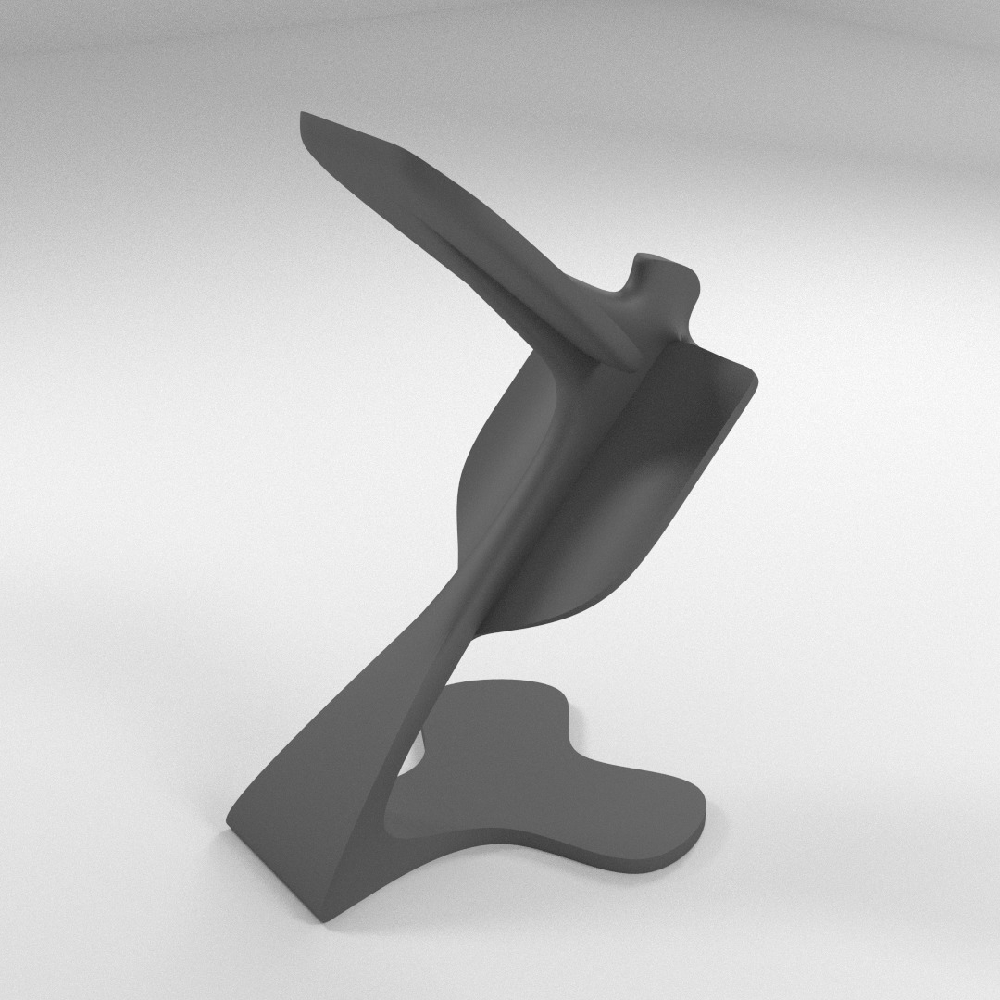

# Chair Reimagined

Daringly angular, yet smooth and organic. Strikingly thin, yet strong and light. With the form of a kneeling chair at a standing height, The Chair Reimagined harbors seemingly contradictory intersections.

---

## Behind the Scenes

*After assembling all the parts.*

*A quick laser cut scale model.*

*Early concept renders.*

Dimensions: 40cm x 55cm x 80cm

Weight: About 10kg

Material: 1/2" Pine Plywood

---

Assignment for: 4.500 Design Computing (Final Project)

Learning Focus: Computer Aided Design, Computer Aided Manufacturing, Scale Models, CNC Milling, Laser Cutting

Media: Chair, Wood, Object

Software: Blender, Rhino, OnShape, MasterCAM, Inkscape

Hardware: Shopbot CNC Mill, Machine Shop Tools, Laser Cutter

Date: December 2015
